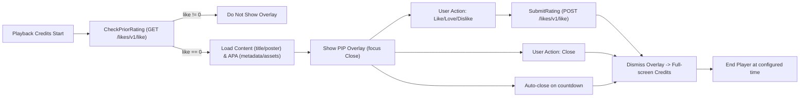
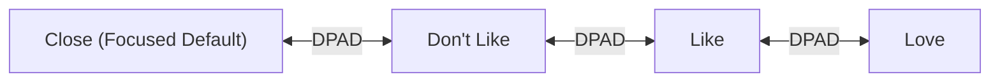

# Android TV Media Rating App — Design, Architecture, and Implementation Plan

## 1. Product Overview and Goals
The Android TV Media Rating App enables viewers to submit quick ratings for Video-on-Demand (VOD) content on a TV experience optimized for DPAD/Leanback input. The primary focus is a post‑playback screen with a picture-in-picture (PIP) visual format that appears during content credits to capture the viewer’s sentiment using “I like it”, “I love it”, and “I don’t like it” actions, while providing clear options to dismiss and resume playback. The system aggregates user feedback, surfaces analytics, and integrates with backend services for media metadata and ratings persistence.

Core goals:
- Capture viewer sentiment unobtrusively after content completes or during credits.
- Provide a fast, DPAD-friendly UI that adheres to TV accessibility and performance expectations.
- Respect prior ratings and avoid repeat prompts.
- Work reliably with fluctuating network conditions, including defined offline handling and safe retries.
- Align with the Ocean Professional theme and modern, minimalist style.

Scope for this iteration:
- Android TV (Kotlin, Leanback) post‑playback rating PIP screen with countdown auto-close.
- Retrieval of media title, artwork, and APA metadata/assets for legends and icons.
- GET check to avoid showing rating UI if previously rated.
- POST submission for new ratings.
- Local caching for resilience; telemetry for usage and performance.

## 2. User Personas and Flows
Personas:
- Casual Viewer: Watches occasionally and provides quick thumbs feedback when prompted.
- Enthusiast: Consumes many titles; values quick, consistent prompts that do not repeat when already rated.
- Household Member: Multiple people share a TV; values minimal friction and explicit close control during credits.

Key flows:
- Post‑Playback Prompt:
  1) Credits begin for a unitary VOD item.
  2) App verifies via /likes/v1/like?group_id=… that user has not rated the content (like != 0).
  3) If not rated and other rules allow, show PIP prompt overlay with focus on Close.
  4) User selects “I like it”, “I love it”, or “I don’t like it”, or presses Close.
  5) Rating is submitted (if selected), overlay dismisses, return to full‑screen credits; End Player shows at the defined time.
- Rewind to before credits:
  - If the viewer previously closed without rating and rewinds before rollingcreditstime, show prompt again when credits resume.
- Auto-close:
  - If user takes no action, close automatically after display_time (default ≤ max_display_time).

## 3. UX Information Architecture and Navigation Model (Android TV DPAD/Leanback)
- Entry point: Playback transitions into credits state.
- Overlay hierarchy:
  - Background: Dimmed poster of played content.
  - PIP Player: Reduced playback window (top-left by default).
  - Content Info: Title header (single line).
  - Message: “Did you like it? Your vote helps us recommend more content like this.”
  - Actions Row (DPAD focusable): I like it, I love it, I don’t like it, Close.
  - Countdown: “Closing in XX seconds” positioned near actions or top-right status area.
- Focus behavior:
  - Initial focus set to Close.
  - DPAD left/right to navigate actions.
  - DPAD center/Enter to select.
  - Back dismisses overlay and returns to full‑screen.
- Navigation model:
  - All actionable elements are in a single focus row, large enough for 10‑foot UI.
  - Non-actionable status text (countdown) is read-only.

## 4. Screen-by-Screen UI Design Guidelines (Ocean Professional Theme)
Theme: “Ocean Professional” (blue primary #2563EB, amber secondary/success #F59E0B, error #EF4444, gradient from-blue-500/10 to gray-50, background #f9fafb, surface #ffffff, text #111827). Use a modern style with subtle shadows, rounded corners (8–12dp), and minimalist affordances.

Screens:
1) Post‑Playback Rating with PIP
   - Background: Blurred/dimmed content poster derived from image_clean_horizontal or fallback to image_background.
   - Overlay: Semi-opaque surface card with 12dp radius; elevation to separate from background.
   - PIP Window: 16:9 mini-player card with subtle shadow and 8dp radius.
   - Title: Single line, text color #111827 on surface; ellipsize end.
   - Message: Secondary text color (e.g., #4B5563) or adjusted TV secondary.
   - Actions:
     - I like it: outline button with primary accent ring and thumbs-up icon.
     - I love it: outline button with amber accent ring and two-thumbs icon (secondary/success color).
     - I don’t like it: outline button with neutral/primary ring and thumbs-down icon.
     - Close (focused default): white outline on focus, negative “X” icon; ensure close focus ring is highly visible for TV.
   - Countdown: Small label, high contrast; updates at 1‑second intervals.
   - Focus states: On focus, increase outline + glow and slightly scale (e.g., 1.04x) with smooth 120–180ms transition.
   - Spacing: Large hit targets (min 64x64dp), 24dp spacing between action buttons.

2) Error-Free Placeholder Handling
   - If a legend’s key is missing in APA metadata: show the key name at that location, with fixed layout dimensions preserved; no visible error text.
   - If a key is empty: leave the space blank; preserve layout size and positions.

Color/accessibility:
- Leverage tv_accent as primary highlight but map to Ocean Professional colors.
- Ensure 4.5:1 contrast for text over backgrounds.
- Focus ring uses white outline with subtle ambient glow for visibility.

## 5. Component Inventory and State Management
Core components (frontend):
- PIPOverlayFragment: Hosts the overlay UI, manages focus, and countdown.
- PIPPlayerView: Mini player surface overlaid on content.
- ActionsRowView: Focusable horizontal list of rating actions and Close.
- CountdownView: Timer display with lifecycle-aware updates.
- MetadataBinder: Binds title, artwork, and legends from APA metadata and content API.
- RatingViewModel: Holds UI state, orchestrates data flows, checks prior rating, submits ratings, and manages countdown.
- NetworkClient (Retrofit/OkHttp): APA metadata, assets, content info, and likes/rating API.
- LocalStore (Room or in-memory + SharedPreferences): Cache last-known APA metadata keys, content posters, and pending rating ops.
- TelemetryLogger: Analytics events for impressions, selections, errors, timing.

State management approach:
- MVVM with LiveData/Flow.
- ViewModel holds:
  - uiState: { isVisible, remainingSeconds, focusItem, title, posterUrl, legends, assets, isRated, errorFlags }
  - networkState: { online, lastSync }
  - ratingState: { priorLike, submissionResult, pendingOffline }
- Repository pattern for network + cache; immutable UI state snapshots emitted to the Fragment. All UI actions trigger intents handled by ViewModel.

## 6. System Architecture
Layers:
- Presentation (Android TV app):
  - Leanback-based Activity/Fragment; Kotlin, coroutines, LiveData/Flow.
- Domain:
  - Use-cases: CheckPriorRating, LoadContentDisplayData, SubmitRating, LoadAPAMetadata, LoadAPAAssets.
- Data:
  - Repositories: RatingsRepository, ContentRepository, APAMetadataRepository, APAAssetsRepository.
  - Data sources: Retrofit services, Local cache (Room or SharedPreferences + file cache for images via Glide).
- External integrations (assumed):
  - Content API: /content/v1/data for poster (image_clean_horizontal; fallback to image_background), title at response.group.common.title.
  - APA metadata: /apa/metadata for legends, settings incl. vod_rating_settings.display_time and .max_display_time.
  - APA assets: /apa/assets for button icons.
  - Likes API: /likes/v1/like GET to check existing rating; POST (or PUT) to submit rating.
- Player:
  - ExoPlayer full-screen with PIP-style reduced view in overlay.

Data flow:
1) Credits start -> trigger CheckPriorRating with group_id.
2) If unrated and rules allow -> Load content artwork/title + APA metadata/assets.
3) Show overlay; start countdown with display_time, bounded by max_display_time.
4) On action select -> SubmitRating; on success, dismiss overlay.
5) On Close or timeout -> dismiss overlay per rules; navigate to End Player timing.

## 7. Data Model and Schema
Entities (app-side, Room or in-memory):
- MediaItem
  - groupId: Long
  - title: String
  - posterUrl: String
  - backgroundUrl: String
  - lastUpdated: Instant
- Rating
  - groupId: Long
  - like: Int (−1 for dislike, 1 for like, 2 for love; 0 means not rated)
  - stars: Int (if available; else 0)
  - time: Instant
- VodRatingSettings
  - displayTimeSeconds: Int
  - maxDisplayTimeSeconds: Int
  - rollingCreditsTimeSeconds: Int
- APAMetadata
  - keys: Map<String, String> (legend keys to values)
- APAAssets
  - icons: Map<String, String> (icon keys to URL)

View models:
- RatingUiState
  - visible: Boolean
  - title: String
  - posterUrl: String
  - message: String
  - actions: [Like, Love, Dislike, Close]
  - focusedAction: ActionType
  - remainingSeconds: Int
  - isRated: Boolean
  - errors: { missingKeys: [String], emptyKeys: [String] }

## 8. APIs and Endpoint Contracts
Note: URLs and request bodies are illustrative based on provided PDF rules.

- GET /likes/v1/like
  - Query: group_id: number
  - Response 200:
    {
      "data": {
        "like": 0 | 1 | 2 | -1,
        "stars": number,
        "time": "YYYY-MM-DDTHH:mm:ssZ",
        "group_id": number,
        "group_uid": string | null
      }
    }
  - Usage: If like != 0, do not show rating overlay.

- POST /likes/v1/like
  - Body:
    {
      "group_id": number,
      "like": 1 | 2 | -1,
      "stars": number, // optional
      "time": "YYYY-MM-DDTHH:mm:ssZ"
    }
  - Response 200/201: same as GET “data” shape.
  - Usage: Submit rating on selection.

- GET /content/v1/data
  - Query: group_id: number
  - Response 200:
    {
      "response": {
        "group": {
          "common": {
            "title": "string"
          },
          "image_clean_horizontal": "url",
          "image_background": "url"
        }
      }
    }
  - Poster selection: Prefer image_clean_horizontal else image_background.

- GET /apa/metadata
  - Response 200:
    {
      "vod_rating_settings": {
        "display_time": 30,
        "max_display_time": 60,
        "rollingcreditstime": 20
      },
      "legend_keys": {
        "rating_title_key": "rating_title",
        "rating_message_key": "rating_message",
        "like_text_key": "rating_like",
        "love_text_key": "rating_love",
        "dislike_text_key": "rating_dislike",
        "close_text_key": "rating_close",
        "countdown_text_key": "rating_countdown"
      }
    }
  - Legend resolution strategy:
    - If key missing: display the key literal where legend would be; keep layout fixed.
    - If key present but empty: show nothing in that space; keep layout fixed.

- GET /apa/assets
  - Response 200:
    {
      "icons": {
        "like": "url",
        "love": "url",
        "dislike": "url",
        "close": "url"
      }
    }

## 9. Offline/Latency and Error Handling Strategies
- Offline detection: Observe ConnectivityManager/NetworkCallback.
- GET checks:
  - If offline, consult local cache of prior ratings; if unknown, default to show overlay but continue normal rule evaluation except the “already rated” check (treat as not rated). Mark actions “will sync”.
- Metadata and assets:
  - Use last-known cached values when unavailable; apply missing/empty key rules.
- Submissions:
  - Queue rating request in local store with exponential backoff retry; debounced to avoid duplicate submissions.
- Timeouts:
  - Network requests use reasonable timeouts (e.g., 3–5 seconds connect, 5–8 seconds read) with logging.
- UI resilience:
  - Never show raw error messages; preserve layout and visual stability.
  - Countdown continues regardless of network state, but submission may be deferred.

## 10. Security and Privacy
- Use HTTPS for all API calls; pin hostnames via OkHttp certificate pinning where possible.
- Do not log PII; redact group_uid if sensitive.
- Store only minimal cached data; encrypt at rest if user or policy requires (EncryptedSharedPreferences).
- Protect API keys/secrets via secure configuration; avoid hardcoding in client.
- Respect user privacy preferences; provide opt-out for analytics where applicable.

## 11. Telemetry and Analytics
Key events:
- overlay_impression(group_id, remaining_duration, source=credits)
- overlay_action_selected(group_id, action=like|love|dislike|close)
- overlay_auto_closed(group_id, display_time_used)
- prior_rating_detected(group_id, like)
- submission_result(group_id, status=success|queued|failed, latency_ms)
- metadata_resolution(key_state=missing|empty|ok)
Metrics:
- Conversion rate of impressions to ratings.
- Average display time before action/close.
- Network error rates and retry success.
Implementation:
- TelemetryLogger with batched dispatch; fallback to offline cache and periodic flush.

## 12. Accessibility for TV
- DPAD navigability: all interactive elements reachable left/right; initial focus on Close per rule.
- Focus visibility: high-contrast focus ring with glow; do not rely solely on color change.
- Text size: TV-safe sizes (title ~32–40sp, message ~22–26sp, buttons ~24–28sp).
- Labels: ContentDescription on actions for TalkBack for TV; concise labels like “Like”, “Love”, “Dislike”, “Close”.
- Color contrast: meet or exceed 4.5:1; avoid pure white on bright backgrounds.
- Motion: limit scale/alpha animations to short durations; avoid nausea-inducing effects.

## 13. Performance Considerations for TV
- Preload artwork and APA metadata during late playback to minimize overlay latency.
- Reuse ExoPlayer for PIP view instead of new instances.
- Glide with memory/disk cache; prefer downsampled artwork matching view size.
- Avoid frequent layout passes; use ConstraintLayout with fixed element sizes on overlay.
- Keep overdraw low; dim background with single overlay rather than stacking.
- Avoid main-thread network operations; use coroutines and suspend functions.

## 14. Release Plan and Milestones
Milestones:
- M0: Skeleton app with Leanback Activity and placeholder overlay (current base).
- M1: Integrate PIPOverlayFragment with DPAD focus, Ocean Professional styling, static assets.
- M2: Implement Content API integration (title, poster), APA metadata and assets loading; missing/empty key handling.
- M3: Implement Likes GET check to suppress UI when previously rated; countdown behavior; Close default focus.
- M4: Implement rating submission flow with retries and offline queue.
- M5: Telemetry events; accessibility polish; performance tuning; QA tests.
- M6: Beta release to internal testers; incorporate feedback; finalize End Player transitions.
- M7: Production release and monitoring.

## 15. Risks and Mitigations
- Inconsistent or slow APIs:
  - Mitigation: caching, timeouts, graceful fallbacks, and clear retry strategies.
- Incorrect credit timing signals:
  - Mitigation: configure rollingcreditstime from APA; allow local overrides for testing.
- Focus traps on TV remotes:
  - Mitigation: automated focus tests; enforce single-row navigation; default focus on Close.
- Asset or metadata key drift:
  - Mitigation: show key literal or empty per rules; maintain stable layout; log telemetry for anomalies.
- Offline environments:
  - Mitigation: cached legends/assets; queue submissions; clear UI feedback without error dialogs.
- Privacy concerns:
  - Mitigation: minimize stored data, encrypt sensitive stores, and avoid PII in logs.

## Appendix A: Suggested Kotlin Structures

```kotlin
// ViewModel
data class RatingUiState(
    val visible: Boolean = false,
    val title: String = "",
    val posterUrl: String = "",
    val message: String = "",
    val remainingSeconds: Int = 30,
    val focusedAction: ActionType = ActionType.CLOSE,
    val isRated: Boolean = false,
    val missingKeys: List<String> = emptyList(),
    val emptyKeys: List<String> = emptyList()
)

enum class ActionType { LIKE, LOVE, DISLIKE, CLOSE }

class RatingViewModel(
    private val ratingsRepo: RatingsRepository,
    private val contentRepo: ContentRepository,
    private val apaRepo: APARepository,
    private val telemetry: TelemetryLogger
) : ViewModel() {
    // Expose StateFlow<RatingUiState> and handle intents
}
```

```kotlin
// API service interfaces (Retrofit)
interface LikesService {
    @GET("/likes/v1/like")
    suspend fun getLike(@Query("group_id") groupId: Long): LikeResponse

    @POST("/likes/v1/like")
    suspend fun postLike(@Body body: LikePostBody): LikeResponse
}

interface ContentService {
    @GET("/content/v1/data")
    suspend fun getContent(@Query("group_id") groupId: Long): ContentResponse
}

interface APAService {
    @GET("/apa/metadata")
    suspend fun getMetadata(): APAMetadataResponse

    @GET("/apa/assets")
    suspend fun getAssets(): APAAssetsResponse
}
```

```kotlin
// Countdown handling
class CountdownController(
    private val initialSeconds: Int,
    private val onTick: (Int) -> Unit,
    private val onFinish: () -> Unit
) {
    // Start/cancel logic using coroutines/Dispatchers.Main
}
```

## Appendix B: Ocean Professional Styling Notes
- Primary: #2563EB (focus glow, button outlines on like/dislike).
- Secondary/Success: #F59E0B (love action highlight).
- Error: #EF4444 (not used prominently; reserved for internal error highlights if needed).
- Background: #f9fafb; Surface: #ffffff; Text: #111827.
- Gradient accents: from-blue-500/10 to gray-50 can be used subtly behind the actions row.

## Appendix C: Mermaid Diagrams

### High-level Architecture


### UI Focus Model


